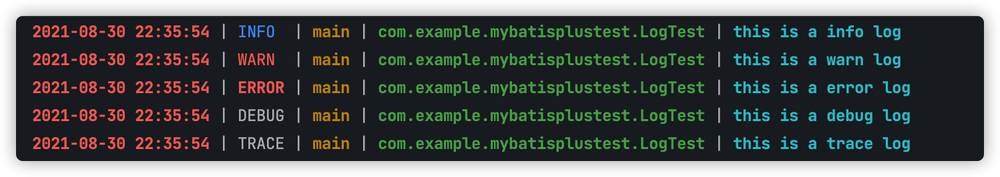
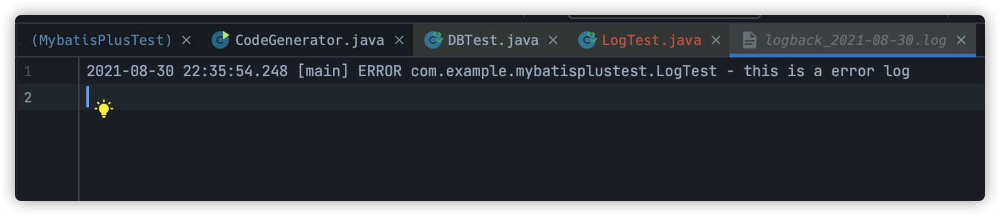

# Slf4j 和 logback 配置及使用

## 一、引入 Maven 依赖

在项目的 pom.xml 中添加 Slf4j 相关的依赖

```xml
<!--velocity-->
<dependency>         	<groupId>org.apache.velocity</groupId>
	<artifactId>velocity-engine-core</artifactId>
	<version>2.3</version>
</dependency>
<!--slf4j-->
<dependency>
	<groupId>org.slf4j</groupId>
	<artifactId>slf4j-api</artifactId>
<version>1.7.32</version>
</dependency>
    <dependency>
    <groupId>org.slf4j</groupId>
    <artifactId>slf4j-log4j12</artifactId>
    <version>1.7.32</version>
</dependency>            
```

## 二、配置日志配置 logback.xml

```xml
<?xml version="1.0" encoding="UTF-8"?>
<!--scan：当此属性设置为true时，配置文件如果发生改变，将会被重新加载，默认值为true。
    scanPeriod：设置监测配置文件是否有修改的时间间隔，如果没有给出时间单位，默认单位是毫秒当scan为true时，此属性生效。默认的时间间隔为1分钟。
    debug：当此属性设置为true时，将打印出logback内部日志信息，实时查看logback运行状态。默认值为false。-->
<configuration scan="true" scanPeriod="60 seconds" debug="false">
    <!--定义日志文件的存储地址 勿在 LogBack 的配置中使用相对路径-->
    <property name="LOG_HOME" value="logs"/>
    <!-- 定义日志格式  -->
    <!--格式化输出：
                %d表示日期，
                %thread表示线程名，
                %-5level：级别从左显示5个字符宽度，
                %msg：日志消息，
                %n是换行符-->
    <property name="LOG_PATTERN" value="%d{yyyy-MM-dd HH:mm:ss.SSS} [%thread] %-5level %logger{50} - %msg%n"/>
    <property name="CONSOLE_LOG_PATTERN"
              value="%boldRed(%d{yyyy-MM-dd HH:mm:ss}) | %highlight(%-5level) | %boldYellow(%thread) | %boldGreen(%logger) | %boldCyan(%msg%n)"/>

    <!-- 控制台输出 -->
    <appender name="CONSOLE" class="ch.qos.logback.core.ConsoleAppender">
        <encoder class="ch.qos.logback.classic.encoder.PatternLayoutEncoder">
            <pattern>${CONSOLE_LOG_PATTERN}</pattern>
        </encoder>
    </appender>

    <!-- 文件输出 -->
    <appender name="FILE" class="ch.qos.logback.core.rolling.RollingFileAppender">
        <!--添加范围过滤-->
        <filter class="ch.qos.logback.classic.filter.ThresholdFilter">
            <level>ERROR</level>
        </filter>
        <rollingPolicy class="ch.qos.logback.core.rolling.TimeBasedRollingPolicy">
            <!--日志文件输出的文件名-->
            <fileNamePattern>${LOG_HOME}/logback_%d{yyyy-MM-dd}.log</fileNamePattern>
            <!--日志文件保留天数-->
            <maxHistory>30</maxHistory>
            <!--指定日志文件上限大小，达到则删除旧的日志-->
            <totalSizeCap>10MB</totalSizeCap>
        </rollingPolicy>
        <encoder>
            <pattern>%d{yyyy-MM-dd HH:mm:ss.SSS} [%thread] %-5level %logger{50} - %msg%n</pattern>
            <charset>UTF-8</charset>
        </encoder>
    </appender>

    <!--异步写入日志-->
    <appender name="ASYNC" class="ch.qos.logback.classic.AsyncAppender">
        <!--不丢失日志，默认，若队列80%已满则丢弃TRACT、DEBUG、INFO级别的日志-->
        <discardingThreshold>0</discardingThreshold>
        <!-- 更改默认的队列的深度,该值会影响性能.默认值为256 -->
        <queueSize>512</queueSize>
        <!-- 添加附加的appender,最多只能添加一个 -->
        <appender-ref ref="FILE"/>
    </appender>

    <springProfile name="dev">
        <logger name="com.example.mybatisplustest" level="trace" additivity="true">
            <appender-ref ref="CONSOLE"/>
            <appender-ref ref="FILE"/>
        </logger>
    </springProfile>
    <!-- 日志输出级别 -->
</configuration>
```

想要自定义日志输出格式只需要在 logback.xml 中更改相应配置即可，具体配置说明不在详述，可在网上查阅

## 三、测试

想要在某个类中输出日志有两种方法

1. 在类上使用注解

```java
@Slf4j
public class className(){...}
```

2. 在类中实例化一个日志输出对象

```java
private final static Logger LOG = LoggerFactory.getLogger(className.class);
```

这两种方法都可以实现日志的输出

以第一种方法为例，具体使用方法见下：

```java
import lombok.extern.slf4j.Slf4j;
import org.junit.jupiter.api.Test;
import org.springframework.boot.test.context.SpringBootTest;

/**
 * @ClassName LogTest
 * @Description 日志测试类
 * @Author LiZijing
 * @Date 2021/8/29
 */
@SpringBootTest
@Slf4j
public class LogTest {
    @Test
    public void logTest(){
        log.info("this is a info log");
        log.warn("this is a warn log");
        log.error("this is a error log");
        log.debug("this is a debug log");
        log.trace("this is a trace log");
    }
}
```

输出结果如下：

> 控制台输出结果



> 日志文件输出结果



